# Lab3 实验报告

## 概述

本项目在实验二设计的 ER 模型基础上进一步完善了数据库结构组织的细节，考虑到用户的多种操作，我们设计了对应的数据类型和约束条件；为了便于用户访问和管理数据，我们在数据库上搭建了基于浏览器-服务器结构的高校信息管理系统。

在实现过程中我们采用了前后端分离的开发模式，前端负责展示数据和交互，后端负责利用数据库处理数据和整合信息。

目前本项目已经部署在了 http://uims.life ，可以直接访问并进行测试，项目源代码在提供的 Github 仓库中。

## 系统总体设计

### 系统模块结构

+   前端 - Vue.js

用于展示数据库的信息，并用户提供易用的交互接口，包括增删查改

+   后端 - Django（Django Rest Framework）

用于衔接数据库和前端部分，接受并处理前端发来的请求，将数据存入数据库；根据前端的请求查询数据库，将数据封装后返回给前端；同时进行错误处理

+   数据库 - MySQL

用于保存和管理数据，使用 MySQL 提供的功能以及 Django 提供的接口创建需要的数据存储结构

### 工作流程简述

+   前端接受用户的输入和操作，发送数据到后端。前端将得到的数据渲染到页面
+   后端解析请求，生成 SQL 语句，发送到数据库获取信息。将数据传回前端
+   数据库根据后端的请求条件进行查询，返回原始信息

## 系统详细设计

### 数据库部分

####  分ER模型设计

+ 校区-专业-班级ER图

  图片中标颜色的属性为主键。

  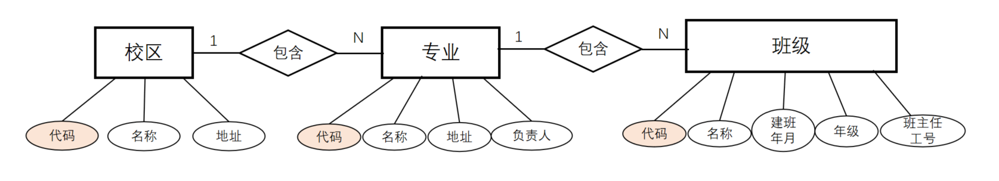

  

+ 人员-教师-学生ER图

  “人员”的“家庭住址”、“家庭邮编”、“家庭电话”可以为空，其余属性不可为空。

  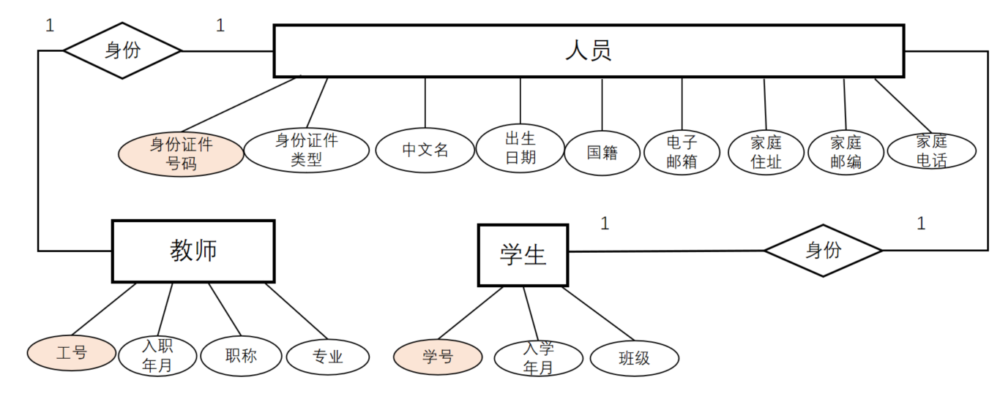

+ 学生-学籍异动ER图

  降级原因和是否已转出团员关系可以为NULL，通过两者中的非NULL者判断当前学籍异动的类型。

  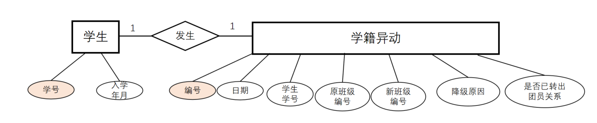

+ 学生选课ER图

  为“开课信息”实体增加“开课信息编号”属性，用于唯一标识开课信息。

  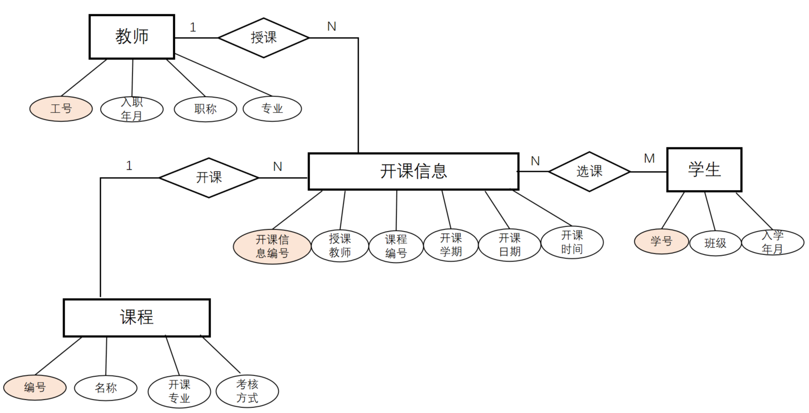

#### ER模型实现与分析

对分ER模型进行集成与优化：

+ 因为实体“专业”中的“负责人”由教师担任，因此“负责人工号”作为表“专业”的外键。
+ 因为实体“班级”中的班主任由教师担任，因此“班主任工号”是表“班级”的外键。
+ 由于每个课程一周只开一节课，为周一至周五的第一节至第九节中的某一节，将开课时间定义为``varchar(20)``类型用于记录具体节次。
+ 身份证件类型（身份证、护照），职称（教授、副教授），学生性别（男、女），降级原因（休学、支教），考核方式（考试、当堂答辩），是否转出团员关系（是、否、不是团员）、开课学期（春、秋）值设置为枚举类型。
+ 由于每个学生选课记录不能重复， 因此在表“学生选课”中外键“开课信息编号”不能重复。在``model.py``中通过``unique_together = ['student_id', 'course_info_id']``实现。
+ 注意到“专业”表中的负责人工号和“教师”表中的专业代码相互依赖，因此二者不能同时要求非空，我们的实现是允许建立专业时专业负责人为空。

最终的ER模型在mysql workbench中实现如下：

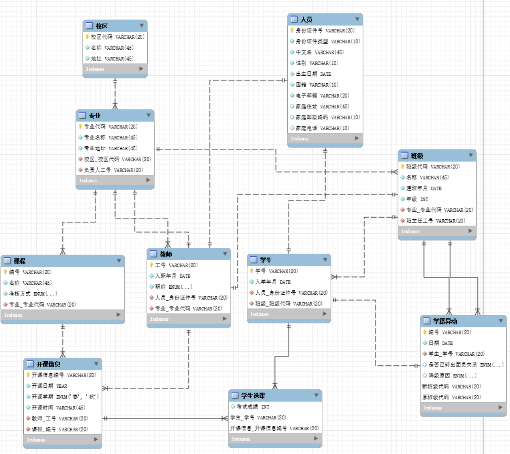

### 后端部分

#### 后端架构

后端使用 django 和 django rest framework 框架处理前端对资源的请求，转化为数据库操作并给出响应。后端与前端的交互通过 HTTP 请求/应答完成，并且遵守RESTful 规范。

具体而言，后端的架构包括以下几个方面：

1. 输入：HTTP请求，包括URL地址、HTTP方法以及请求主体等。
2. 输出：HTTP响应，一般包括响应状态以及一个含有返回信息的json作为响应主体。按照惯例，200OK的响应代表操作成功，并在返回的json中给出被查询/插入的数据库对象信息；4xx、5xx的响应代表操作失败，并在返回的json中给出具体原因。
3. 程序流程图：

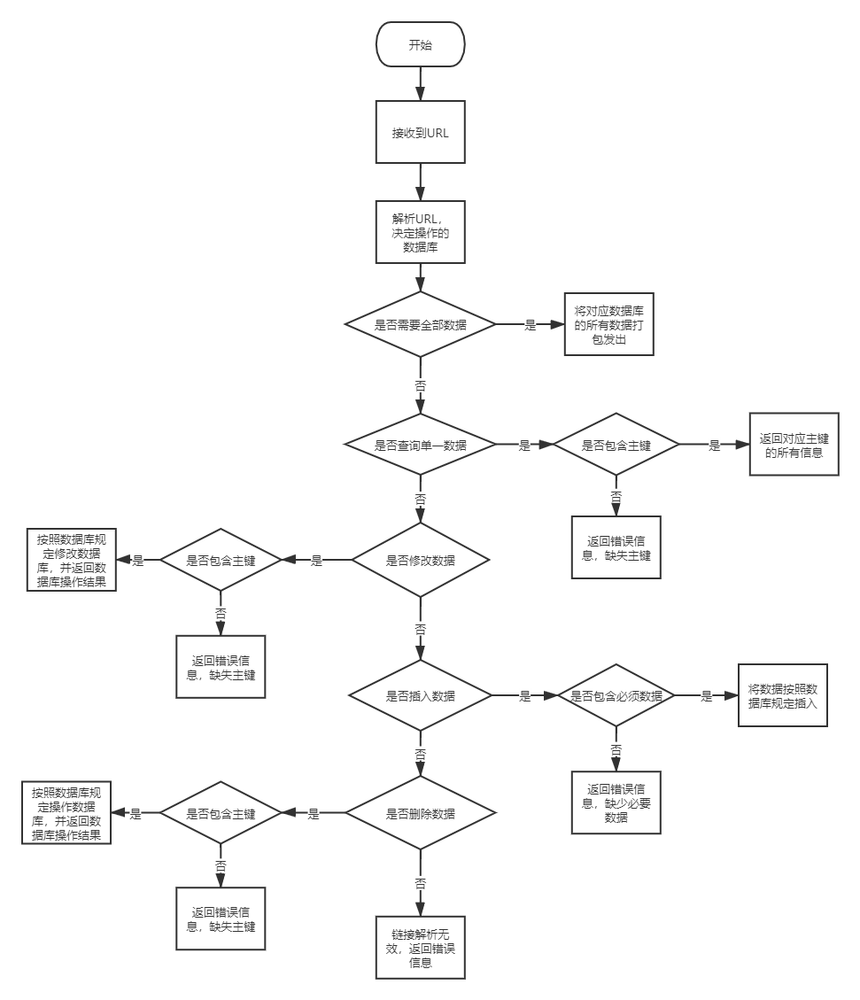

4. 注：
	- 后端中不包含过滤，所有的查询基于主键，或者将整个表发给前端，由前端过滤。
	- 修改、插入、删除即使按照流程图中正确操作，但如果不符合数据库规定，也会返回错误信息。
	- 修改包括整体修改和部分修改，但区别不大，此处合并。
	- 不同表要求略有区别，详细内容取决于具体接口。

#### 系统实现与测试

##### 运行界面

后端是基于HTTP请求完成访问的，并没有直接的运行界面。
我们可以利用命令行软件发送HTTP请求，进行测试。以插入校区为例：

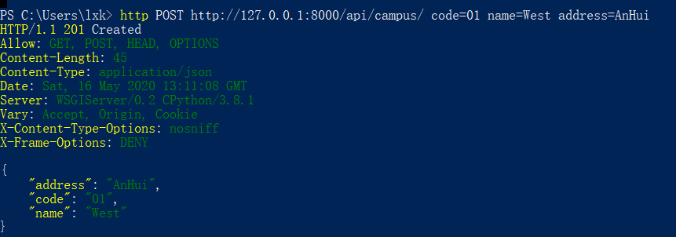

更加详细的样例参见测试。

##### 实现

后端的实现基于django rest framework，其整体框架如下：

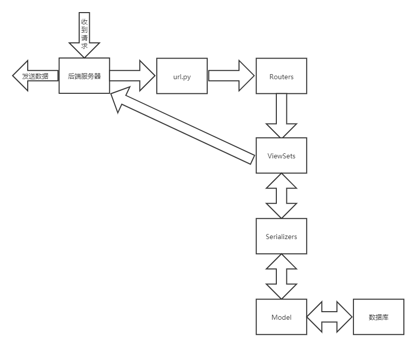

各个模块功能如下：

- Model：使用django ORM（对象-关系模型）设计整个数据库的关系和数据类型，同时提供MySQL DBMS的python操作接口。
- Serializers：将json格式的请求主体/响应主体和Model中的数据对象进行相互转化，实现数据的序列化/反序列化，同时决定数据库的哪些域可以传输到前端。
- ViewSet：对HTTP请求进行解析，确定要执行的数据库操作交给Serializers完成，并在操作完成后根据不同结果给出相应的响应信息。
- url和Routers：对HTTP请求的url进行解析，确定操作的数据类型（表），并将附加信息传入ViewSet。

##### 测试

*注：为了便于测试，以下样例操作在django提供的管理界面完成，这是django提供的后台管理界面，部署运行时不会使用。由于管理界面的操作直接承接model，所以部分功能可能表现不同。*

###### 增加，删除，修改和主键约束

###### 增加

以增加一个校区为例，起始只有一个校区West：

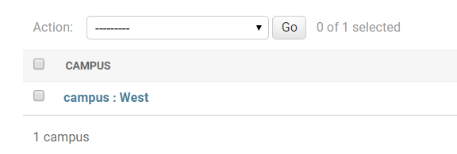

我们可以插入一个新校区East：

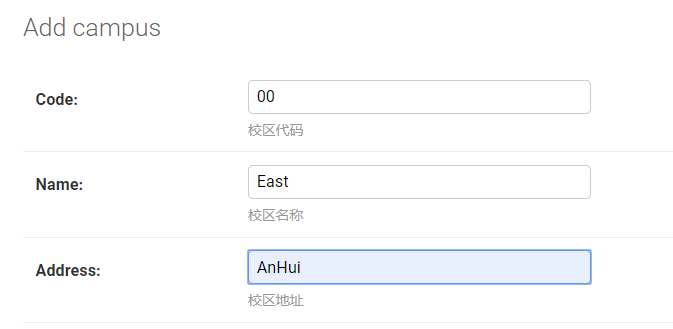
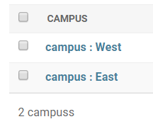

但是，增加的时候如果信息不全，校区代码（主键）重复会报错：

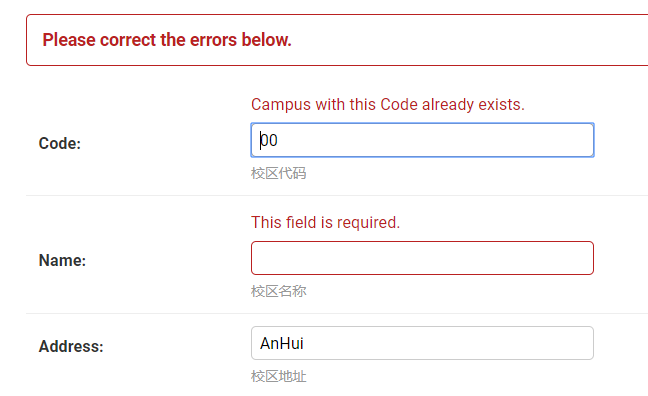

###### 修改

例如，我们可以将East修改为South：

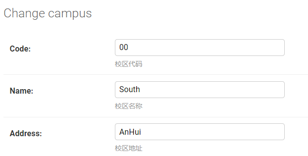
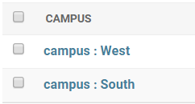

修改的时候，部分字段（校区代码等主键）是不允许修改的，系统会设置为只读，从而对该字段的修改会被忽略（但不会报错）。例如我们开始时有如下数据（只包含两个校区）：

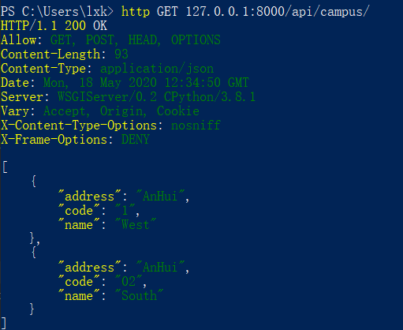

我们发送请求修改校区South(02)的代码，改为03，发现虽然未报错，但校区代码并没有修改：

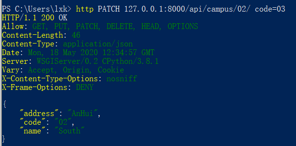

再次请求获取整个表的信息，可以发现数据库没有变化：

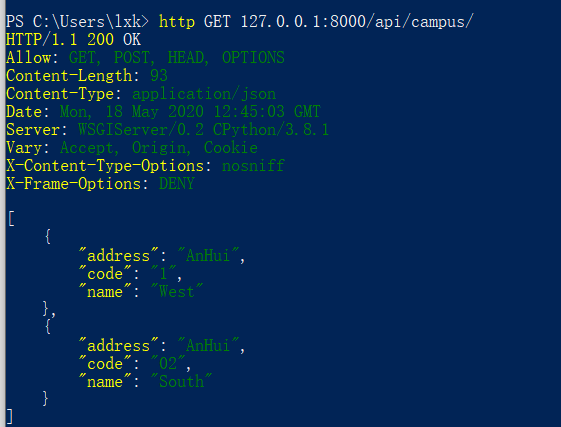

###### 删除

我们可以将上面的South(O2)删除： 

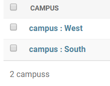
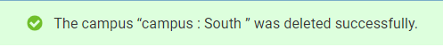

然而，当存在关联专业的时候，不允许删除。例如，West已经关联了专业cs，现在删除West就会报错：

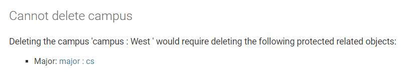

###### 外键约束

当插入的时候，若有外键约束，会检查约束。例：添加专业时，校区代码作为外键：

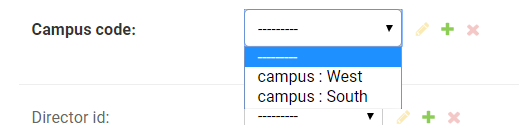

在管理界面中可以看到有提供选择栏来选择。如果我们手动发送请求，并且校区不在数据库里面，就会报错。例如，当前数据库只存在01和02两个校区代码，但发送的请求中校区代码为03：

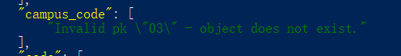

##### 用户自定义需求

某些字段不可修改（如主键）的说明已经在前文描述过了，所以此处只描述一些特殊的要求。

###### 教师离职

教师离职时会检查其相关信息，若有相关的信息，必须由其他老师接管才能删除。如下所示，班级 cs-17-3 班主任为工号 111 ，则删除该老师会报错：

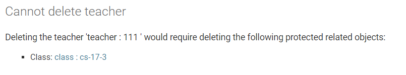

修改使这位老师卸任班主任，然后即可删除：

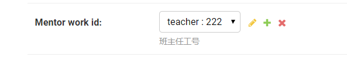
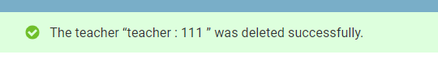
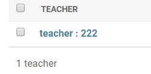

同理，如果老师有正在开的课程，也必须修改课程信息使得老师不再授课后，才能删除老师。

###### 学生毕业

如果学生还没有毕业，那么其信息是不能删除的。这里我们只考虑四年制，也就是按照学生入学日期进行判断，如果当前日期距离学生入学不满四年，那么表明学生尚未毕业，不予删除。例如，我们有一位学生，其入学时间为2017年9月1日：

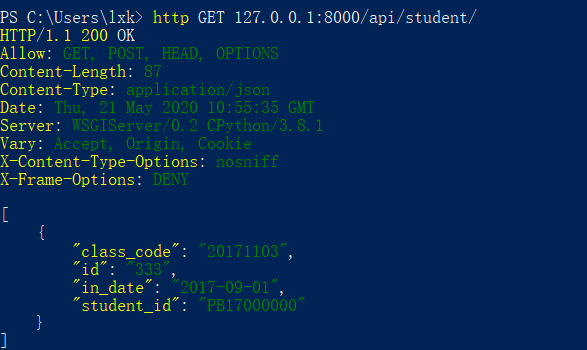

此时该学生还没有毕业，将其删除会导致报错：

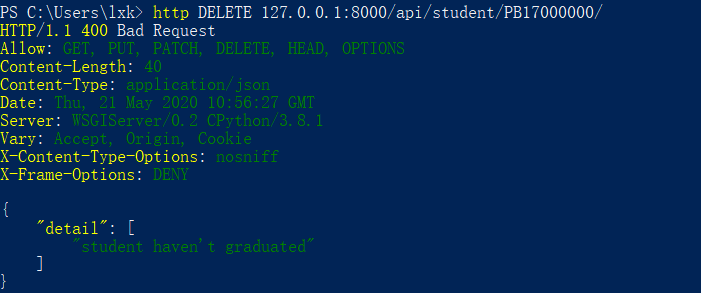

###### 不可重复选课

我们还要求学生不能重复选课，也就是选课记录中学生学号和开课编号二者不能同时重复。我们使用唯一性约束达成这样的效果，要求学号和开课编号二者整体唯一，具体可见数据库设计部分。

### 前端部分

前端使用 Vue.js 来将从后端数据库得到的数据渲染到 Web 页面

使用 axios 来与后端进行通信，发送和请求数据库信息

#### 交互界面与逻辑设计

##### 页面组织

本项目中包含了多个逻辑较为独立的表，因此在设计管理界面时将每个数据库中的表分别组织为一个独立的页面，并通过统一的导航栏，转向不同的表页面

##### 数据显示与同步

前端显示的信息只需要在每次用户修改表后才需要同步，因此在每次用户进入页面或者进行了增、删、改之后重新向后端发出请求，获取相应的数据，并利用 v-model 将数据实时渲染到页面中显示

由于从后端获取的数据已经是字符序列格式，因此为不同的字段添加文本框后直接将值填入其中即可

##### 增删查改

为了实现需要的增、删、查、改功能，在每个表地页面中设置了添加按钮以及通用的搜索框；对于具体到某一项的删、改功能，在表中每一条记录中都设置了独立的删除和修改按钮

同时为了便于处理不同的数据类型，对一般的字符串或数值类型，提供了基本的输入框、对于枚举类型，提供了下拉选择；对于日期类型，提供了日历选择器。这样在用户输入完成后，可以直接将数据序列化为 json 并发向后端进行解析和处理不再需要额外的转换

#### 实现效果与测试

首先将项目部署到本地或服务器上

（为了便于演示，我们已经将其部署在了 http://uims.life ）

在浏览器中打开部署的页面，进入到项目主页

左侧是整个系统中所有的表

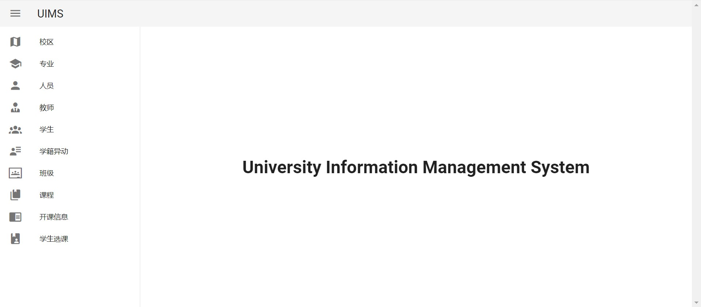

在左侧导航栏中可以选择要管理的表，如进入 “校区” 表

可以在右侧看到目前表中的所有信息，以及相关的操作按钮 

在表的最下方，可以调整每页显示的记录数量，以及浏览不同的页

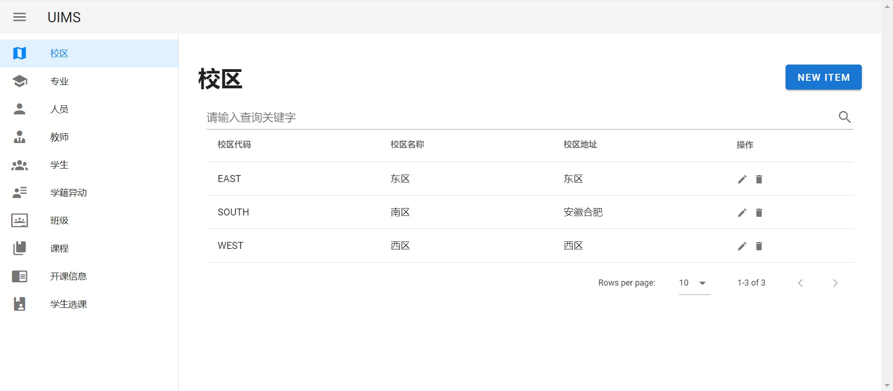

在表上方的搜索框中，可以输入任意字段的关键词，并进行模糊查询

如下图中查询了校区代码中包含了 “WE” 的记录

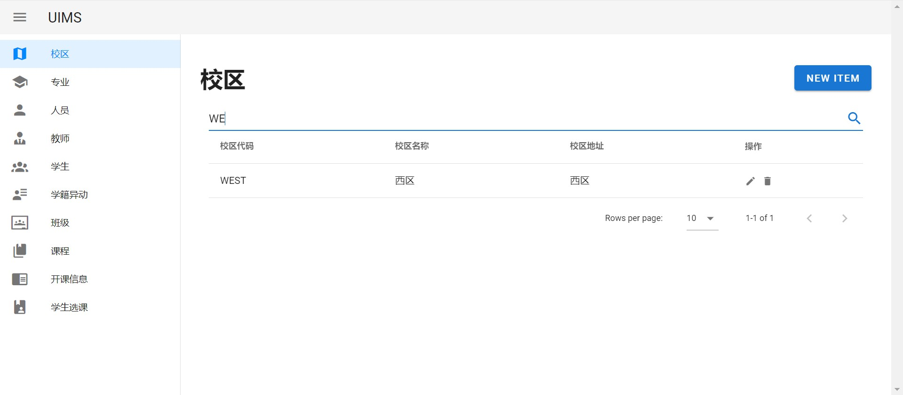

此外，还可以根据不同属性的值进行排序

如下图中按出生日期，对“人员”表中的所有记录进行排序

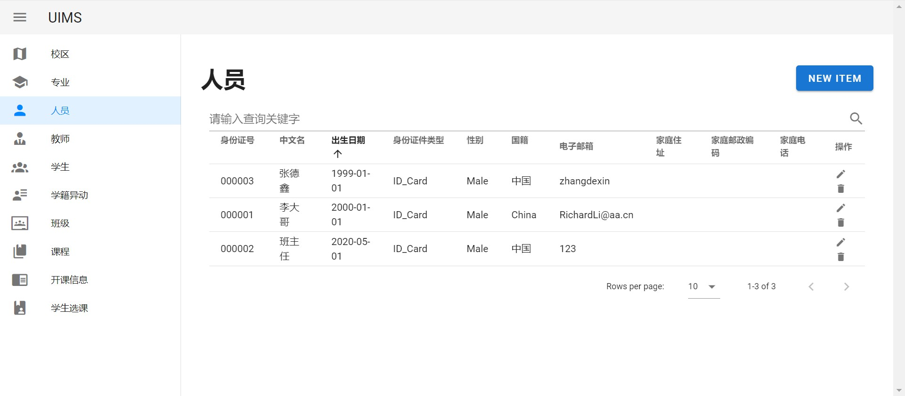

在表的上方有 “NEW ITEM” 按钮，点击后在弹出的对话框中可以插入新的记录，同时对应不同类型的字段值，输入方式会有不同（包括选择、日期等）；此外如果某字段为必填项，会用红色字体提示 “该项不能为空”

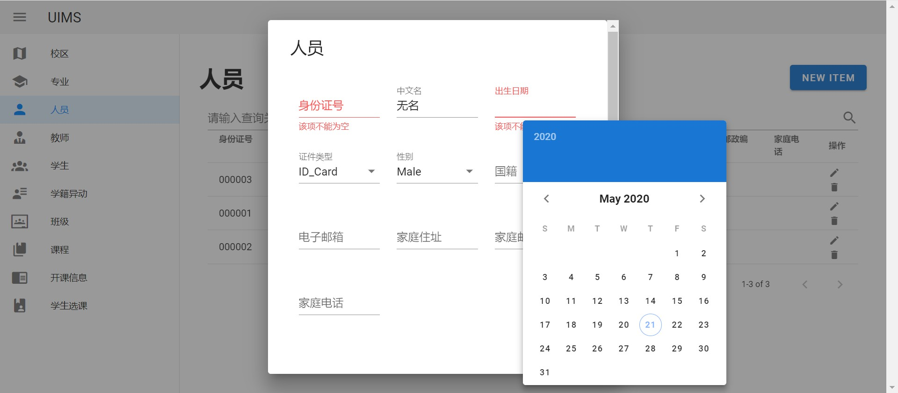

在每条记录中的最后一列是对该项的操作按钮，包括了修改和删除

点击修改按钮会弹出对话框提示能够修改的信息，不能修改的信息（如作为主键的各类代码）会显示为灰色并无法修改

如果修改或删除违反了数据库的约束，会给出相应的错误提示

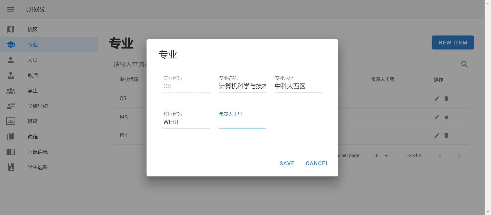

#### 前后端通信实现

后端使用 Django Rest Framework 生成对数据库操作的接口，前端使用 axios 发送请求，对数据库进行增删查改（如 POST 插入和修改表项，GET 获取表项，DELETE 删除表项）。每当在网页中打开不同的表页面时，网页都会发送请求，获取完整的表数据显示在页面上。

用户进行增删改操作时，如果操作合法，则页面可以看到信息被更改。每当出现不合法的操作时（如删除存在外键引用的项，插入重复主键的项），网页都会弹出警告，并显示错误的大概信息，以指示用户正确地插入数据。下图显示了一个删除存在外键引用的项时出现的错误。

#### 项目部署

此数据库管理系统已经部署在了 [uims.life](http://uims.life) 上。服务器端使用 nginx + uwsgi + Django + mysql 进行配置。

nginx 部分提供静态内容的服务，包括前端界面所有 html，css 和 js 文件。nginx还将所有数据库请求发给 uwsgi 进一步处理。

Web服务器网关接口（wsgi）是为 Python 语言定义的 Web 服务器和 Web 应用程序或框架之间的一种简单而通用的接口。uwsgi 是 wsgi 的一个实现。在服务器中，uwsgi 接收 nginx 转发的关于数据库的请求，并交给 Django 进行进一步的处理。同时 uwsgi 也将Django想要发送的数据转发给 nginx，由 nginx 发送给用户。

Django 会分析用户的对数据库的请求，将请求解析为 SQL 语句，并在本机部署的mysql 服务中执行。无论执行成功还是失败，Django 都会返回相应的信息供前端判断与分析。

## 讨论和总结

通过本次实验我们认识到，虽然数据库设计可能十分复杂，但是好的数据库设计可以给数据库系统的实现带来很多便利。

在数据库的构建以及前后端项目的开发过程中，我们在实践中增进了对现代 Web 应用框架 Django ，以及对数据库使用方式与作用的理解；同时经过调试和优化的过程，加深了我们对于数据库原理与系统的理解，提高了我们对于数据库系统与应用这门课程的认识。

## 成员分工

|        成员         |                  工作                  |
| :-----------------: | :------------------------------------: |
| PB17061250  陈   昂 |    组长、页面组织和数据交互逻辑实现    |
|  PB17050941 李喆昊  |            数据库设计和实现            |
|  PB17050963 詹佑翊  |          前后端通信与项目部署          |
|  PB17051102 张德鑫  | 数据库模型的实现、后台数据的管理和传输 |
|  PB17051115 刘旭铠  | 数据库模型的实现、后台数据的管理和传输 |

