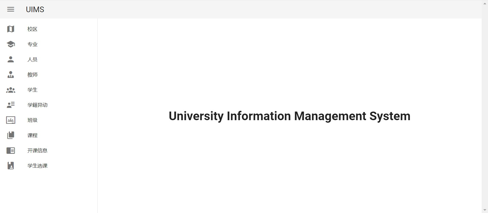
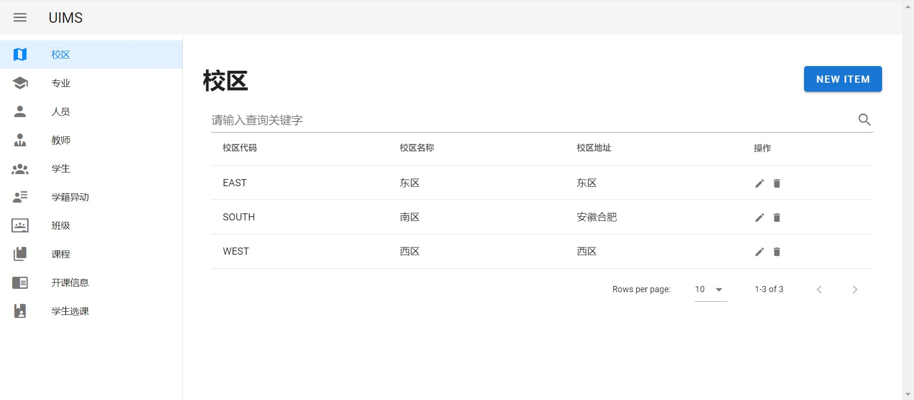
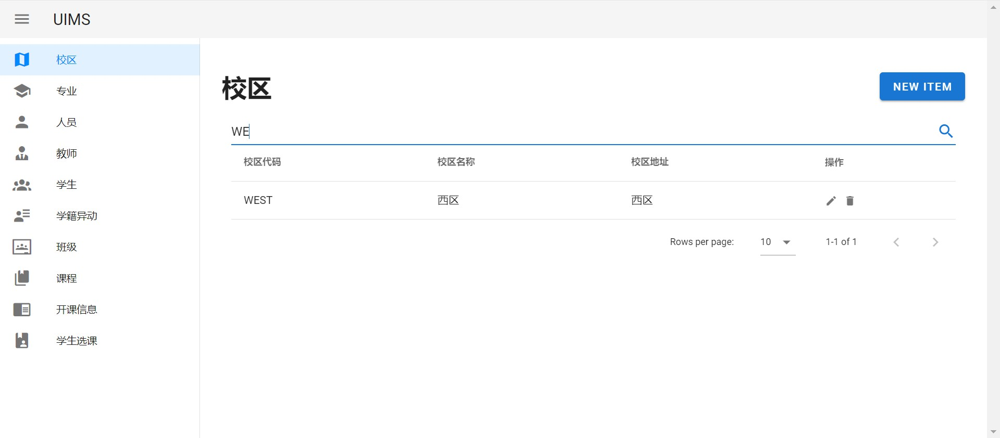
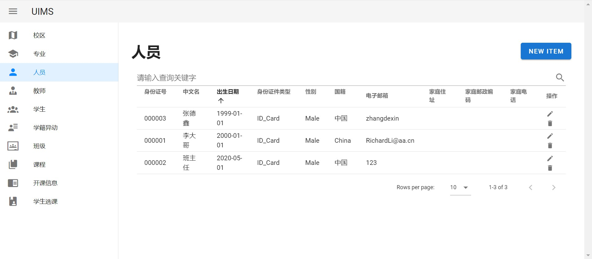
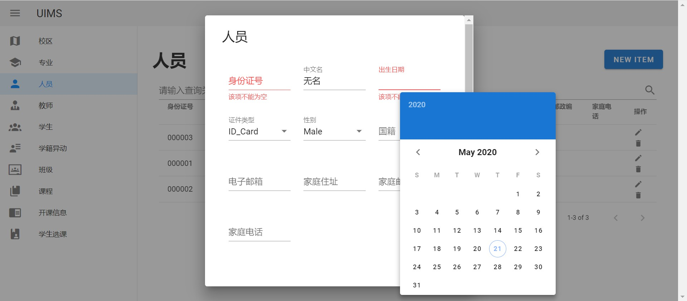
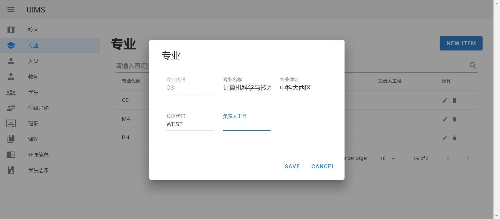

# 系统详细设计 前端部分

## 前端架构

前端使用 Vue.js 来将从后端数据库得到的数据渲染到 Web 页面

使用 axios 来与后端进行通信，发送和请求数据库信息

## 交互界面与逻辑设计

### 页面组织

本项目中包含了多个逻辑较为独立的表，因此在设计管理界面时将每个数据库中的表分别组织为一个独立的页面，并通过统一的导航栏，转向不同的表页面

### 数据显示与同步

前端显示的信息只需要在每次用户修改表后才需要同步，因此在每次用户进入页面或者进行了增、删、改之后重新向后端发出请求，获取相应的数据，并利用 v-model 将数据实时渲染到页面中显示

由于从后端获取的数据已经是字符序列格式，因此为不同的字段添加文本框后直接将值填入其中即可

### 增删查改

为了实现需要的增、删、查、改功能，在每个表地页面中设置了添加按钮以及通用的搜索框；对于具体到某一项的删、改功能，在表中每一条记录中都设置了独立的删除和修改按钮

同时为了便于处理不同的数据类型，对一般的字符串或数值类型，提供了基本的输入框、对于枚举类型，提供了下拉选择；对于日期类型，提供了日历选择器。这样在用户输入完成后，可以直接将数据序列化为 json 并发向后端进行解析和处理不再需要额外的转换

## 实现效果与测试

首先将项目部署到本地或服务器上

（为了便于演示，我们已经将其部署在了 http://uims.life）

在浏览器中打开部署的页面，进入到项目主页

左侧是整个系统中所有的表

在左侧导航栏中可以选择要管理的表，如进入 “校区” 表

可以在右侧看到目前表中的所有信息，以及相关的操作按钮 

在表的最下方，可以调整每页显示的记录数量，以及浏览不同的页

在表上方的搜索框中，可以输入任意字段的关键词，并进行模糊查询

如下图中查询了校区代码中包含了 “WE” 的记录

此外，还可以根据不同属性的值进行排序

如下图中按出生日期，对“人员”表中的所有记录进行排序

在表的上方有 “NEW ITEM” 按钮，点击后在弹出的对话框中可以插入新的记录，同时对应不同类型的字段值，输入方式会有不同（包括选择、日期等）；此外如果某字段为必填项，会用红色字体提示 “该项不能为空”

在每条记录中的最后一列是对该项的操作按钮，包括了修改和删除

点击修改按钮会弹出对话框提示能够修改的信息，不能修改的信息（如作为主键的各类代码）会显示为灰色并无法修改

如果修改或删除违反了数据库的约束，会给出相应的错误提示

## 总结和讨论

【替换为 /test.md 中提到的坑点】