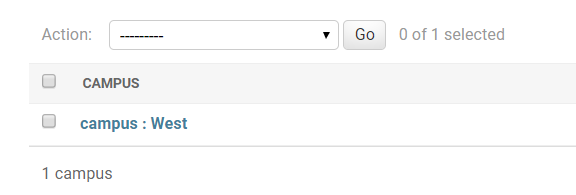
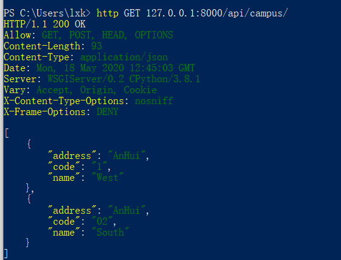

# 系统详细设计 后端部分

## 后端架构

后端使用django和django rest framework框架处理前端对资源的请求，转化为数据库操作并给出响应。后端与前端的交互通过HTTP请求/应答完成，并且遵守RESTful规范。

具体而言，后端的架构包括以下几个方面：

1. 输入：HTTP请求，包括URL地址、HTTP方法以及请求主体等。
2. 输出：HTTP响应，一般包括响应状态以及一个含有返回信息的json作为响应主体。按照惯例，200OK的响应代表操作成功，并在返回的json中给出被查询/插入的数据库对象信息；4xx、5xx的响应代表操作失败，并在返回的json中给出具体原因。
3. 程序流程图：

4. 注：
	- 后端中不包含过滤，所有的查询基于主键，或者将整个表发给前端，由前端过滤。
	- 修改、插入、删除即使按照流程图中正确操作，但如果不符合数据库规定，也会返回错误信息。
	- 修改包括整体修改和部分修改，但区别不大，此处合并。
	- 不同表要求略有区别，详细内容取决于具体接口。

## 系统实现与测试

### 运行界面

后端是基于HTTP请求完成访问的，并没有直接的运行界面。
我们可以利用命令行软件发送HTTP请求，进行测试。以插入校区为例：

更加详细的样例参见测试。

### 实现

后端的实现基于django rest framework，其整体框架如下：

各个模块功能如下：

- Model：使用django ORM（对象-关系模型）设计整个数据库的关系和数据类型，同时提供MySQL DBMS的python操作接口。
- Serializers：将json格式的请求主体/响应主体和Model中的数据对象进行相互转化，实现数据的序列化/反序列化，同时决定数据库的哪些域可以传输到前端。
- ViewSet：对HTTP请求进行解析，确定要执行的数据库操作交给Serializers完成，并在操作完成后根据不同结果给出相应的响应信息。
- url和Routers：对HTTP请求的url进行解析，确定操作的数据类型（表），并将附加信息传入ViewSet。

### 测试

*注：为了便于测试，以下样例操作在django提供的管理界面完成，这是django提供的后台管理界面，部署运行时不会使用。由于管理界面的操作直接承接model，所以部分功能可能表现不同。*

#### 增加，删除，修改和主键约束

##### 增加

以增加一个校区为例，起始只有一个校区West：

我们可以插入一个新校区East：

但是，增加的时候如果信息不全，校区代码（主键）重复会报错：

##### 修改

例如，我们可以将East修改为South：

修改的时候，部分字段（校区代码等主键）是不允许修改的，系统会设置为只读，从而对该字段的修改会被忽略（但不会报错）。例如我们开始时有如下数据（只包含两个校区）：

我们发送请求修改校区South(02)的代码，改为03，发现虽然未报错，但校区代码并没有修改：

再次请求获取整个表的信息，可以发现数据库没有变化：

##### 删除

我们可以将上面的South(O2)删除： 

然而，当存在关联专业的时候，不允许删除。例如，West已经关联了专业cs，现在删除West就会报错：

#### 外键约束

当插入的时候，若有外键约束，会检查约束。例：添加专业时，校区代码作为外键：

在管理界面中可以看到有提供选择栏来选择。如果我们手动发送请求，并且校区不在数据库里面，就会报错。例如，当前数据库只存在01和02两个校区代码，但发送的请求中校区代码为03：

#### 用户自定义需求

某些字段不可修改（如主键）的说明已经在前文描述过了，所以此处只描述一些特殊的要求。

##### 教师离职

教师离职时会检查其相关信息，若有相关的信息，必须由其他老师接管才能删除。如下所示，班级cs-17-3班主任为工号111，则删除该老师会报错：

修改使这位老师卸任班主任，然后即可删除：

同理，如果老师有正在开的课程，也必须修改课程信息使得老师不再授课后，才能删除老师。

##### 学生毕业

如果学生还没有毕业，那么其信息是不能删除的。这里我们只考虑四年制，也就是按照学生入学日期进行判断，如果当前日期距离学生入学不满四年，那么表明学生尚未毕业，不予删除。例如，我们有一位学生，其入学时间为2017年9月1日：

此时该学生还没有毕业，将其删除会导致报错：

