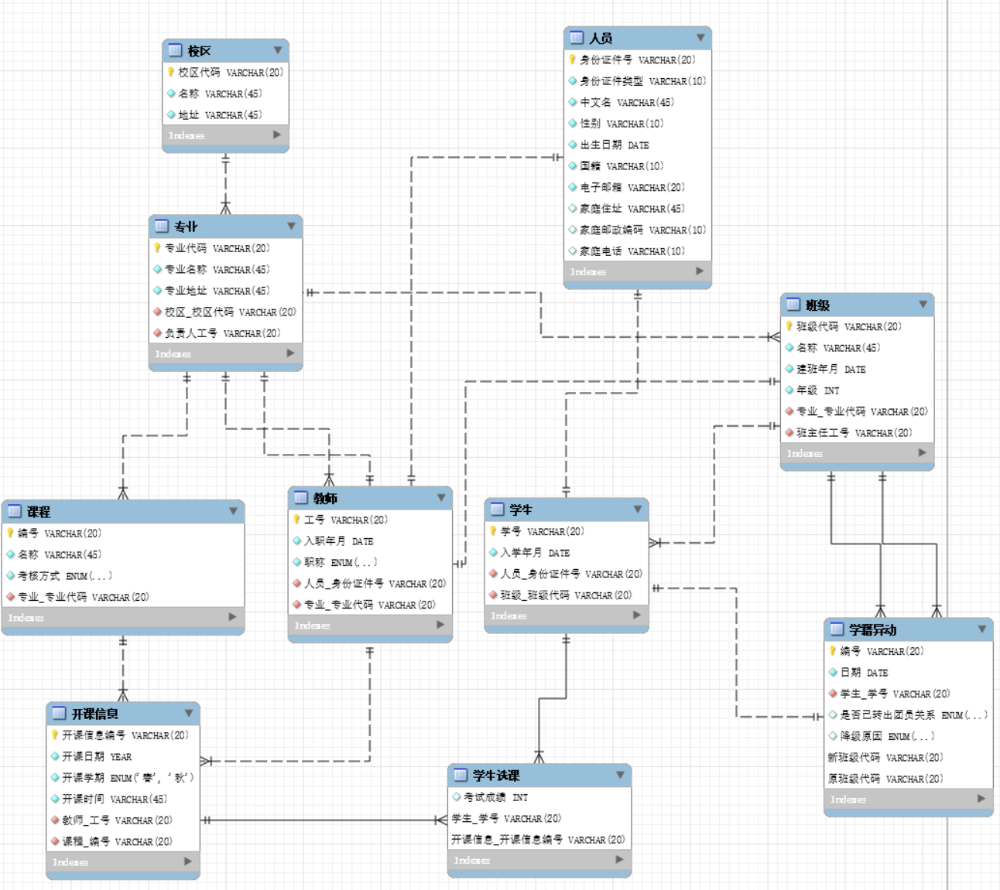

# 数据库设计

## 目录

1. 分ER模型设计
2. ER模型实现与分析

## 一. 分ER模型设计

+ 校区-专业-班级ER图

  图片中标颜色的属性为主键。

  

  

+ 人员-教师-学生ER图

  “人员”的“家庭住址”、“家庭邮编”、“家庭电话”可以为空，其余属性不可为空。

  

+ 学生-学籍异动ER图

  降级原因和是否已转出团员关系可以为NULL，通过两者中的非NULL者判断当前学籍异动的类型。

  

+ 学生选课ER图

  为“开课信息”实体增加“开课信息编号”属性，用于唯一标识开课信息。

  

## ER模型实现与分析

对分ER模型进行集成与优化：

+ 因为实体“专业”中的“负责人”由教师担任，因此“负责人工号”作为表“专业”的外键。
+ 因为实体“班级”中的班主任由教师担任，因此“班主任工号”是表“班级”的外键。
+ 由于每个课程一周只开一节课，为周一至周五的第一节至第九节中的某一节，将开课时间定义为``varchar(20)``类型用于记录具体节次。
+ 身份证件类型（身份证、护照），职称（教授、副教授），学生性别（男、女），降级原因（休学、支教），考核方式（考试、当堂答辩），是否转出团员关系（是、否、不是团员）、开课学期（春、秋）值设置为枚举类型。
+ 由于每个学生选课记录不能重复， 因此在表“学生选课”中外键“开课信息编号”不能重复。在``model.py``中通过``unique_together = ['student_id', 'course_info_id']``实现。

最终的ER模型在mysql workbench中实现如下：

